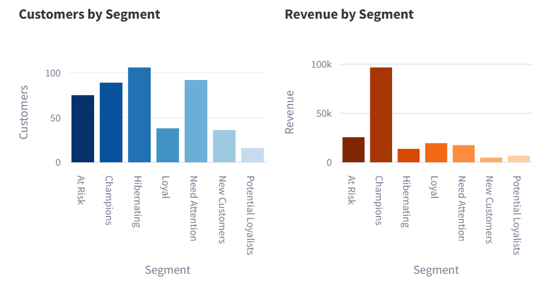

# E-commerce Sales Dashboard 🛒

Analyze **£9.7M** in transactions to uncover **revenue drivers, seasonality, and high‑value customer segments** for a UK online retailer — packaged as an interactive **Streamlit dashboard**.


---

## TL;DR

- **What:** Interactive dashboard for sales performance + customer segmentation (RFM)
- **Key insights:** November revenue spikes ~3× (holiday season) and the top ~20% of customers drive ~78% of revenue
- **Stack:** Python, Pandas, Plotly, Streamlit

---

## Quickstart (5 minutes)

### Option A — fastest (runs on included sample data)

```bash
git clone <your-repo-url>
cd 01-ecommerce-sales-dashboard

make setup
make sample
```

### Option B — reproduce full analysis (with raw dataset)

1) Download **Online Retail II** (UCI) and place `online_retail_II.xlsx` in `data/raw/`:

```bash
make data
```

2) Run the pipeline + launch the app:

```bash
make reproduce
make demo
```

**Expected runtime:** under ~2 minutes on sample data.

---

## Business questions answered

1. **Revenue trends:** Which months drive the most sales? Are there predictable patterns?
2. **Geography:** Which countries contribute most revenue? Where is growth potential?
3. **Products:** What items are the top sellers (by revenue/volume)?
4. **Customer value:** Who are the highest‑value customers and how concentrated is revenue?

---

## Three visuals (and what they mean)

### 1) Seasonal revenue trend


**Takeaway:** Revenue peaks sharply in **November**, suggesting inventory + marketing should ramp ahead of the holiday surge.

### 2) Customer segmentation (RFM)


**Takeaway:** A relatively small group of customers accounts for a large share of revenue → prioritize retention and targeted offers.

### 3) Geographic performance


**Takeaway:** International revenue is uneven → focus expansion/activation on the strongest non‑UK markets.

---

## Data provenance & notes

- **Source:** UCI Machine Learning Repository — *Online Retail II* (UK online retailer transactions)
- **What’s in it:** Invoice‑level transactions (dates, product descriptions, quantities, prices, and customer IDs)
- **Cleaning highlights:** removed cancellations/returns (negative quantities), handled missing customer IDs, and standardized timestamps

---

## Repo structure

- `demo/` — Streamlit app
- `src/` — reusable modules (loading, preprocessing, metrics)
- `notebooks/` — exploration and analysis notebooks
- `docs/` — case study + images
- `data/sample/` — small sample dataset for quick runs

---

## Case study

Read the full write‑up here: **[`docs/case_study.md`](docs/case_study.md)**

---

## How to talk about this project (30 seconds)

“I built an interactive sales dashboard for a UK online retailer using Python, Pandas, Plotly, and Streamlit. The analysis shows a strong November revenue spike and that a small segment of customers drives most revenue. The dashboard helps with inventory planning, retention targeting, and market expansion decisions.”

---

## Next improvements (optional)

- Add a lightweight forecasting tab (naive baseline vs seasonal baseline) for planning
- Add product category taxonomy (rule‑based or embedding clustering) for deeper merchandising insights
- Deploy the Streamlit app (Streamlit Community Cloud) and link it on your GitHub profile
