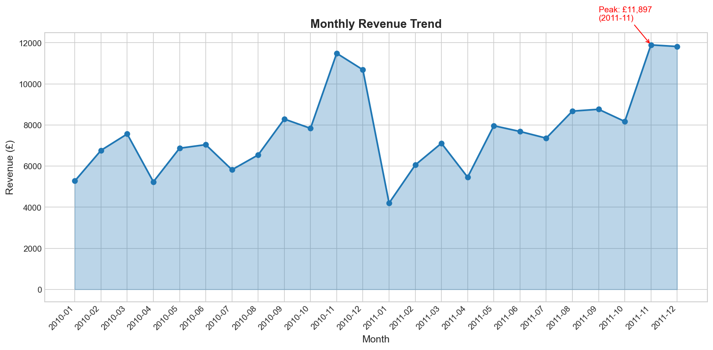
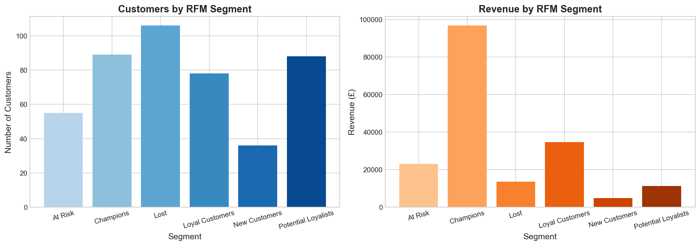
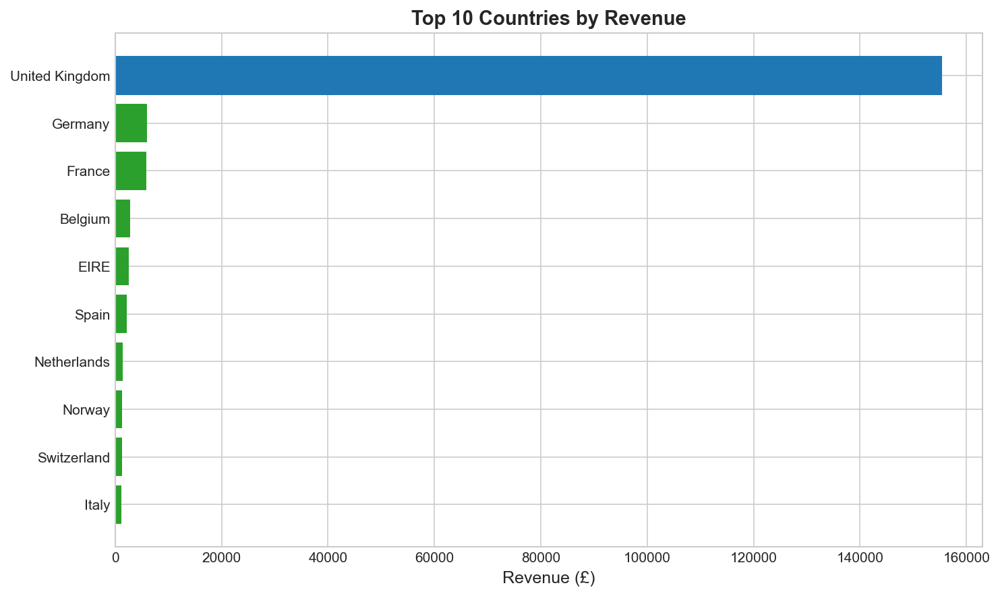
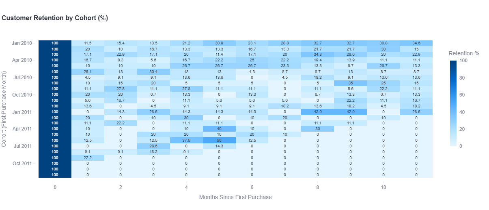

# E-commerce Sales Dashboard 🛒

Analyze **£9.7M** in transactions to uncover **revenue drivers, seasonality, and high‑value customer segments** for a UK online retailer — packaged as an interactive **Streamlit dashboard**.

---

[](https://ecommerce-sales-dashboard-e9y4yllmwsai5xwagdyrgf.streamlit.app/)

## TL;DR

- **What:** Interactive dashboard for sales performance + customer segmentation (RFM)
- **Key insights:** November revenue spikes ~3× (holiday season) and the top ~20% of customers drive ~78% of revenue
- **Stack:** Python, Pandas, Plotly, Streamlit

> **Note on data:** Headline findings (£9.7M, 541K transactions, 5,942 customers) are derived from the full UCI Online Retail II dataset. The GitHub repo includes a synthetic sample for quick demo purposes — results from the sample will differ from the full-dataset numbers shown in the case study and README.

---

## Quickstart (5 minutes)

### Option A — fastest (runs on included sample data)

```bash
git clone https://github.com/AshishPatel14S/ecommerce-sales-dashboard.git
cd ecommerce-sales-dashboard

make setup
make sample
```

### Option B — reproduce full analysis (with raw dataset)

1) Download **Online Retail II** (UCI) and place `online_retail_II.xlsx` in `data/raw/`:

```bash
make data
```

2) Run the pipeline + launch the app:

```bash
make reproduce
make demo
```

**Expected runtime:** under ~2 minutes on sample data.

---

## Business questions answered

1. **Revenue trends:** Which months drive the most sales? Are there predictable patterns?
2. **Geography:** Which countries contribute most revenue? Where is growth potential?
3. **Products:** What items are the top sellers (by revenue/volume)?
4. **Customer value:** Who are the highest‑value customers and how concentrated is revenue?
5. **Retention:** Do customers come back after their first purchase? How fast do cohorts drop?

---

## Four visuals 

### 1) Seasonal revenue trend


**Takeaway:** Revenue peaks sharply in **November**, suggesting inventory + marketing should ramp ahead of the holiday surge.

### 2) Customer segmentation (RFM)


**Takeaway:** Clear separation between low-value vs high-value segments; Champions contribute a disproportionate share of revenue → prioritize retention/upsell for this group.

### 3) Geographic performance


**Takeaway:** International revenue is uneven → focus expansion/activation on the strongest non‑UK markets.

### 4) Cohort Retention


**Takeaway:** Month-1 retention averages **~10.9%**, and most cohorts drop sharply after the first purchase — improving the **first 30-day repeat** rate is the highest-impact lever for growth.


---

## Data provenance & notes

- **Source:** UCI Machine Learning Repository — *Online Retail II* (UK online retailer transactions)
- **What’s in it:** Invoice‑level transactions (dates, product descriptions, quantities, prices, and customer IDs)
- **Cleaning highlights:** removed cancellations/returns (negative quantities), handled missing customer IDs, and standardized timestamps
- **More details:** docs/case_study.md

---

## Repo structure

```text
.
├── demo/                # Streamlit app (entry: demo/app.py)
├── src/                 # preprocessing + analysis scripts
├── notebooks/           # exploration + analysis notebooks
├── docs/                # case study + demo gif + images
├── data/
│   ├── sample/          # sample dataset for quick runs
│   ├── raw/             # raw dataset location (not committed)
│   └── processed/       # processed outputs used by the app (optional/demo)
├── Makefile
└── requirements.txt
```


---

## Case study

Read the full write‑up here: **[`docs/case_study.md`](docs/case_study.md)**

---

## Future Scope

- Add a lightweight forecasting tab (naive baseline vs seasonal baseline) for planning
- Add product category taxonomy (rule‑based or embedding clustering) for deeper merchandising insights

## License

- MIT
